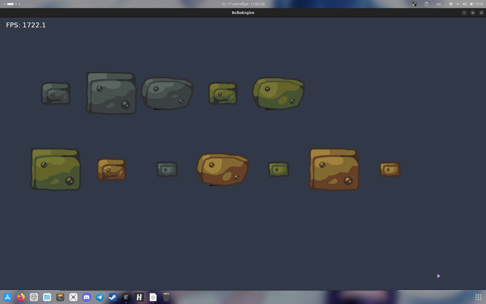
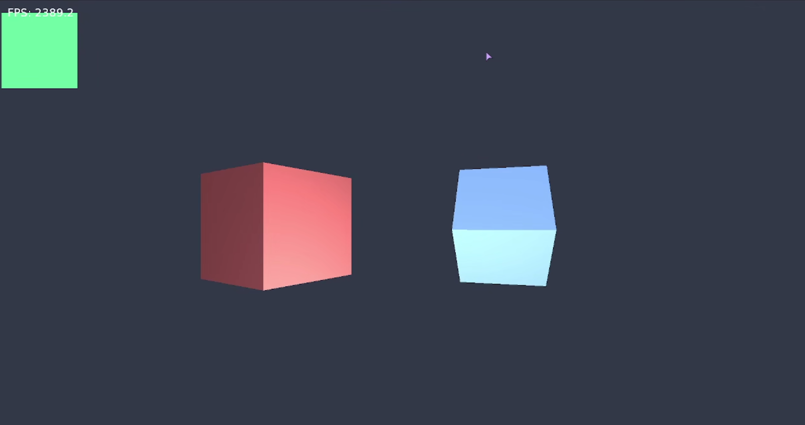

<div>

<h1> BulbaEngine</h1>

<p>
<b>Lightweight and experimental game engine written in C</b>
</p>

<p>
Low-level. Modular. Experimental.
</p>

<br>

</div>

<a href="https://github.com/grib-i/BulbaEngine">

</a>
<a href="https://github.com/grib-i/BulbaEngine/releases">

</a>
<a href="https://github.com/grib-i/BulbaEngine">

</a>
<a href="LICENSE">

</a>

<br>

<div>
  
  
  
  
</div>

<br><br>

<a href="https://grib-i.github.io/BulbaEngineDocs/">

</a>
<a href="https://grib-i.github.io/BulbaEngineDocs/en/getting-started/">

</a>
<a href="https://grib-i.github.io/BulbaEngineDocs/en/roadmap/">

</a>

---

## ✦ About

**BulbaEngine** is a lightweight game and graphics engine written in **C**.

The project focuses on:

- low-level control
- modular architecture
- simple and understandable APIs
- rendering experiments
- small graphical applications
- learning how game engines work internally

> **Keep the engine small. Keep the API understandable. Keep control in the developer's hands.**

---

## 📌 Project Status

| Property         | Value           |
| ---------------- | --------------- |
| **Version**      | `0.9.4`         |
| **Status**       | 🧪 Experimental |
| **Language**     | C               |
| **Build System** | CMake           |
| **Platforms**    | Linux · Windows |
| **Architecture** | Modular         |

---

## 📸 Showcase

<div align="center">




</div>

---

## 🧩 Features

- 🖥️ Rendering
- 🎨 Materials and lighting
- 🧊 3D objects
- 📐 Math utilities
- 🧱 Modular engine architecture
- ⚙️ CMake-based build system
- 🧪 Experimental systems
- 🔧 Low-level API

---

## 📦 Dependencies

BulbaEngine currently requires:

| Dependency     | Purpose                 |
| -------------- | ----------------------- |
| **Vulkan**     | Graphics API            |
| **GLFW**       | Windowing and input     |
| **FreeType**   | Font rendering          |
| **libpng**     | PNG image loading       |
| **glslc**      | GLSL shader compilation |
| **CMake**      | Build system            |
| **C compiler** | Building the engine     |

### Ubuntu / Debian

```bash
sudo apt install \
    build-essential \
    cmake \
    libvulkan-dev \
    libglfw3-dev \
    libfreetype6-dev \
    libpng-dev \
    glslc
```

---

## 🚀 Getting Started

### Clone

```bash
git clone https://github.com/grib-i/BulbaEngine.git && cd BulbaEngine
```

## install

```bash
./install
```

The installer builds the engine and installs its libraries, headers and CMake integration into the system.

By default, the installation prefix is:

```text
/usr/local/
```

After installation, BulbaEngine can be used as a system library from other CMake projects.

### Uninstall

```bash
sudo ./install --uninstall
```

---

## 🔗 Using BulbaEngine

After installation, another CMake project can locate the engine with:

```cmake
find_package(BulbaEngine REQUIRED)
```

Then link it with:

```cmake
target_link_libraries(MyGame PRIVATE BulbaEngine::BulbaEngine)
```

---

## 🛠️ CMake Dependencies

BulbaEngine checks its required dependencies during configuration:

```cmake
find_package(Vulkan REQUIRED)
find_package(glfw3 REQUIRED)
find_package(Freetype REQUIRED)
find_package(PNG REQUIRED)

find_program(GLSLC glslc REQUIRED)
```

If one of the required dependencies is missing, CMake stops with an error instead of producing an incomplete build.

---

## 🌿 Development

BulbaEngine uses a simple branch structure:

```text
main
└── Stable releases

develop
└── Active development

feature/*
└── Individual features and experiments
```

Create a feature branch:

```bash
git switch develop
git switch -c feature/physics
```

Push it:

```bash
git push -u origin feature/physics
```

Merge it back into `develop`:

```bash
git switch develop
git merge feature/physics
git push
```

Stable releases are merged into `main`.

---

## 📚 Documentation

<a href="https://grib-i.github.io/BulbaEngineDocs/">

</a>

<a href="https://github.com/grib-i/BulbaEngine/wiki">

</a>

---

## 🛣️ Roadmap

| System          | Status        |
| --------------- | ------------- |
| **Core**        | 🟢 Active     |
| **Math**        | 🟢 Active     |
| **Renderer**    | 🟡 Developing |
| **Physics**     | 🟡 Planned    |
| **Audio**       | 🟡 Planned    |
| **Scripting**   | 🟡 Developing |
| **WebAssembly** | 🟡 Planned    |

---

## 🤝 Contributing

Contributions, experiments and ideas are welcome.

See the project documentation for development guidelines.

---

## ⭐ Support

<a href="https://github.com/grib-i/BulbaEngine">

</a>

---

## 📄 License

BulbaEngine is licensed under the **MIT License**.

<a href="LICENSE">

</a>

Copyright © 2026 **grib_i**

---

<div align="center">

### BulbaEngine

<sub>Built with C • Experiment • Break things • Build again</sub>

</div>
